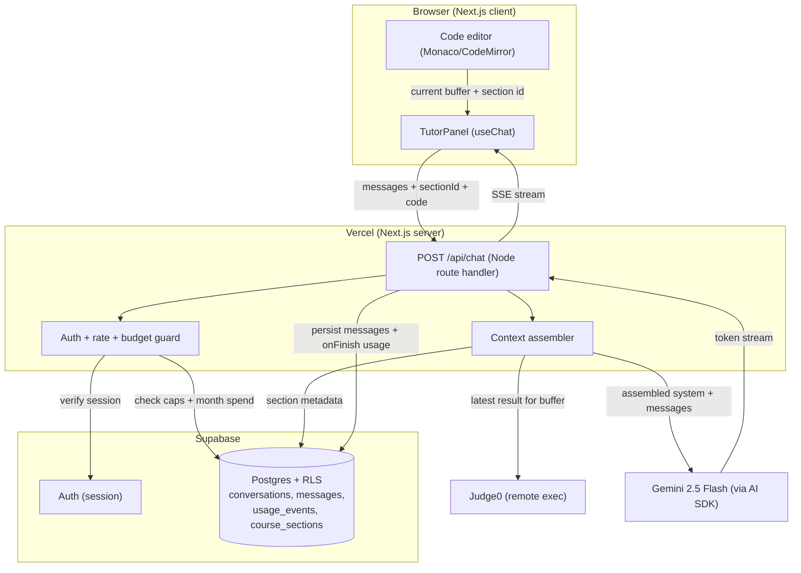
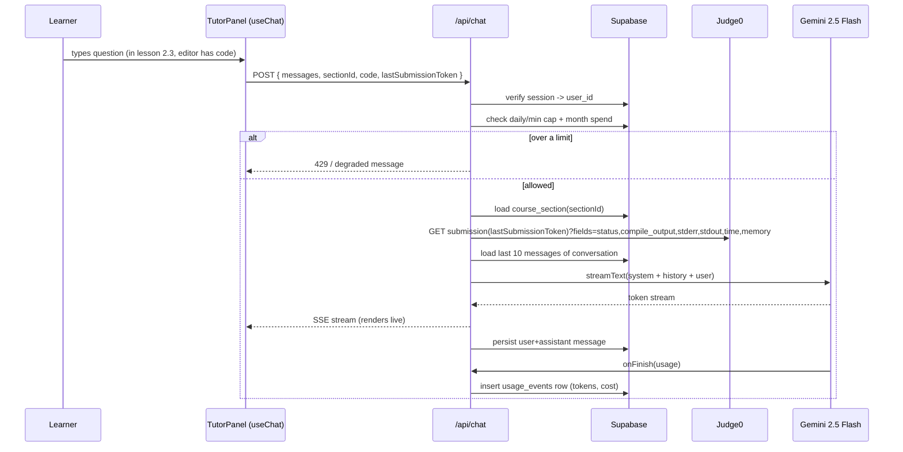
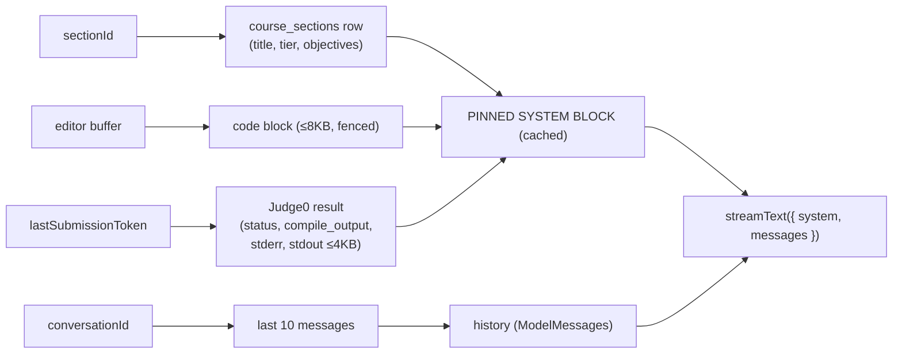
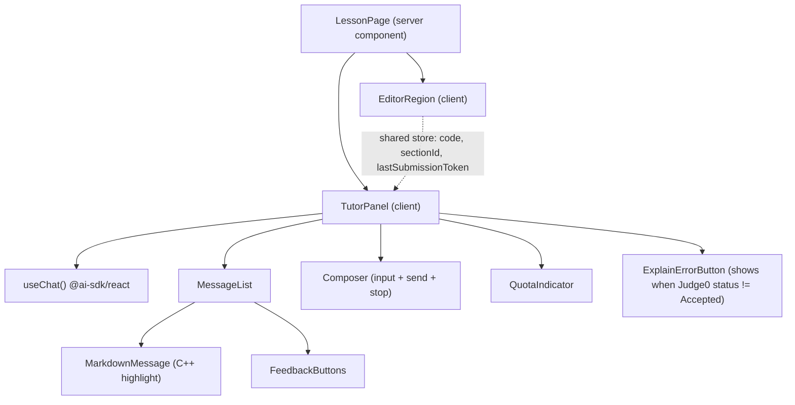

# design.md — cpproad AI Tutor

Technical architecture for the contextual AI Tutor. Targets the existing stack: **Next.js (App Router) on Vercel · Supabase (Auth + Postgres + RLS) · Judge0 (remote C++ execution) · Vercel AI SDK v5**. Implements every requirement in `requirements.md`; resolve ambiguity against `STEERING.md`.

---

## 1. System architecture



Code is **executed only by Judge0**, triggered by the editor's existing "Run" flow. The chat path *reads* the most recent Judge0 result; it never compiles. This keeps the tutor cheap and side-effect-free.

### 1.1 Request lifecycle



---

## 2. AI model selection

**Recommendation: Google Gemini 2.5 Flash as the default**, behind the Vercel AI SDK so it stays swappable.

### Why

- **Cost fits the constraints.** Gemini Flash sits in the budget tier — current public guides put Gemini 2.5 Flash at $0.15/$0.60 per 1M tokens (input/output), with the cheaper Gemini 3.1 Flash-Lite at $0.10/$0.40 available as a downgrade path. (Verify exact rates at build time — pricing moves monthly.) With prompt caching, Gemini Flash's cached input runs about $0.15/M, which makes the repeated static system prompt nearly free.
- **Coding quality is adequate for tutoring.** This is explain-and-nudge, not agentic multi-file editing. Flash-class models comfortably decode compiler errors and explain C++ concepts; Google's Flash tiers are positioned for lower-cost high-volume usage and score well on price-to-performance.
- **Provider continuity.** Gemini is already in the founder's stack (existing keys, billing, operational familiarity), satisfying STEERING C7.
- **Generous free tier** absorbs early traffic — Google offers among the most generous free tiers, up to ~1,000 daily requests at no cost.

### Cost math (typical conversation)

Assume per message: ~2,500 input tokens assembled context (mostly cached system block) + ~600 output tokens; ~5 messages/conversation.
At $0.15/$0.60 per M (and treating most input as cached at $0.15/M): ≈ (12,500 × $0.15 + 3,000 × $0.60) / 1e6 ≈ **$0.0037/conversation** — well under the $0.01 target (NFR-COST-1). 50 msgs/day × 30 days at this rate is a few dollars/month per heavy user; the $50 hard cap covers a meaningful early cohort.

### Documented alternatives (swap via one provider line)

| Model | ~Price in/out (per 1M) | When to switch |
|---|---|---|
| Gemini 3.1 Flash-Lite | ~$0.10 / $0.40 | Cheapest path if budget is tight and quality holds |
| DeepSeek V3.2 | ~$0.14 / $0.28 | Cheapest *capable* coder, but separate provider + review data-residency before sending user code |
| GPT-5.3-Codex | ~$1.50 in | If tutoring quality on hard C++ needs a bump |
| Claude Haiku 4.5 | ~$0.25 / $1.25 | Balanced quality/cost alternative |

Sources: cost comparisons cite DeepSeek V3.2 at $0.14/$0.28 per 1M, among the cheapest high-quality options and GPT-5.3-Codex at ~$1.50/M input and Claude Sonnet 4.6 strongest for coding at $3/$15; Claude Haiku at $0.25/$1.25.

> Note: GPT-3.5 (named in the original brief) is obsolete in 2026 and is not a candidate.

---

## 3. Context management strategy

The server assembles a structured context object per request, then renders it into a **pinned system block** (cacheable) plus the user turn.



**System prompt skeleton** (assembled server-side, FR-CTX-4):

```
You are the cpproad C++ tutor. Teach, don't solve.

[PEDAGOGY] Favor Socratic nudges and minimal illustrative snippets.
Never produce a full working solution to the lesson exercise; give the next
conceptual step. Decode any compiler/runtime error in plain language first.
Redirect non-C++ requests back to the lesson.

[CURRENT LESSON] Tier: {tier} — {section_title}
Objectives: {objectives}

[LEARNER CODE]      (≤8KB, truncated with marker)
```cpp
{editor_buffer}
```

[LAST EXECUTION]    (omit if none)
Status: {status_description}
Compile output: {compile_output|none}
stderr: {stderr|none}
stdout (truncated): {stdout}
time: {time}s  memory: {memory}KB
```

Caching: the static instruction header is identical across requests and is marked for **prompt caching** (FR-COST-6); only lesson/code/error fields vary. Context budget is enforced before the call (default 12k tokens, FR-COST-3): trim history oldest-first, then truncate stdout, then stderr, then code.

Judge0 fetch: `GET {JUDGE0_API_URL}/submissions/{token}?base64_encoded=true&fields=status,compile_output,stderr,stdout,time,memory` — base64 is used because GCC emits non-printable characters in compile errors; the server decodes before injecting. The default Judge0 submission response carries exactly these fields (`stdout, time, memory, stderr, token, compile_output, message, status`).

---

## 4. API design

### `POST /api/chat` (Node runtime — needs Supabase server client + service-role usage writes)

**Request body**
```ts
{
  conversationId?: string;      // omitted on first message in a section
  sectionId: string;            // course section the learner is on
  code: string;                 // current editor buffer
  lastSubmissionToken?: string; // most recent Judge0 token, if any
  messages: UIMessage[];        // AI SDK message history from useChat
}
```

**Server flow**
1. `getUser()` from Supabase server client → 401 if absent (FR-AUTH-1, FR-AUTH-3).
2. Validate body, reject > 64 KB (NFR-SEC-5).
3. Guard: daily count, per-minute count, current-month spend vs hard cap → 429 / degraded (FR-COST-2/4).
4. Resolve/create conversation for (user, sectionId) (FR-CHAT-4).
5. Assemble context (Section 3). Fetch Judge0 result if token present.
6. `streamText({ model: google('gemini-2.5-flash'), system, messages: convertToModelMessages(trimmed), maxOutputTokens: 1024, abortSignal: AbortSignal.timeout(30_000) })`.
7. Return `result.toUIMessageStreamResponse()` (FR-CHAT-2).
8. Persist user message immediately; persist assistant message + insert `usage_events` in `onFinish` (FR-CHAT-3, FR-COST-1).

**Supporting endpoints**
- `POST /api/chat/feedback` — `{ messageId, value: 'up'|'down' }` (FR-CHAT-6).
- `POST /api/chat/reset` — `{ sectionId }` soft-archives the conversation (FR-CHAT-5).
- `GET /api/chat/quota` — returns `{ usedToday, dailyCap }` for FR-UI-5.

**Error contract** — every endpoint returns `{ error: { code, message } }` with codes: `UNAUTHENZ` (401), `RATE_LIMITED` (429), `BUDGET_EXCEEDED` (429), `BAD_REQUEST` (400), `UPSTREAM` (502). The client maps each to a friendly inline message (NFR-REL-1/3).

---

## 5. Frontend component architecture



- **State sharing.** Editor and tutor share a lightweight client store (Zustand/Context) holding `code`, `sectionId`, `lastSubmissionToken`. `useChat`'s `sendMessage` attaches these as `body` fields so each turn carries fresh context (FR-CTX-2/3).
- **Streaming render.** `useChat` from `@ai-sdk/react`; render `message.parts` of type `text` incrementally; Markdown + C++ syntax highlighting (FR-UI-2).
- **Panel, not page.** Collapsible right-side drawer beside the editor (FR-UI-1); editor stays interactive if the panel errors (FR-UI-7).
- **Affordances.** "Explain this error" pre-fills a message when the latest Judge0 status ≠ Accepted (FR-UI-4); thumbs up/down per message (FR-UI-6); quota indicator at ≥ 80% usage (FR-UI-5); stop-generation button during stream (FR-UI-3).

---

## 6. Database schema (Supabase Postgres, RLS on every table)

```sql
-- course content (seeded; read-only to learners)
create table course_sections (
  id           text primary key,          -- e.g. 'basics.control-flow'
  tier         text not null,             -- 'basics'|'memory-oop'|'stl-templates'|'advanced'
  title        text not null,
  objectives   text not null,             -- short bullet text injected into context
  order_index  int  not null
);

create table conversations (
  id          uuid primary key default gen_random_uuid(),
  user_id     uuid not null references auth.users(id) on delete cascade,
  section_id  text not null references course_sections(id),
  status      text not null default 'active',  -- 'active'|'archived'
  created_at  timestamptz not null default now(),
  updated_at  timestamptz not null default now(),
  unique (user_id, section_id, status)         -- one active conversation per section
);

create table messages (
  id              uuid primary key default gen_random_uuid(),
  conversation_id uuid not null references conversations(id) on delete cascade,
  user_id         uuid not null references auth.users(id) on delete cascade,
  role            text not null,           -- 'user'|'assistant'
  content         text not null,
  feedback        text,                    -- 'up'|'down'|null
  created_at      timestamptz not null default now()
);

create table usage_events (
  id              uuid primary key default gen_random_uuid(),
  user_id         uuid not null references auth.users(id) on delete cascade,
  conversation_id uuid references conversations(id) on delete set null,
  model           text not null,
  input_tokens    int  not null,
  output_tokens   int  not null,
  cost_usd        numeric(10,6) not null,
  created_at      timestamptz not null default now()
);

create index on messages (conversation_id, created_at);
create index on usage_events (user_id, created_at);
create index on usage_events (created_at);   -- monthly spend rollup

-- RLS: learners touch only their own rows (FR-AUTH-2)
alter table conversations enable row level security;
alter table messages      enable row level security;
alter table usage_events  enable row level security;

create policy own_conversations on conversations
  for all using (auth.uid() = user_id) with check (auth.uid() = user_id);
create policy own_messages on messages
  for all using (auth.uid() = user_id) with check (auth.uid() = user_id);
create policy read_own_usage on usage_events
  for select using (auth.uid() = user_id);
-- usage_events INSERT is done with the service-role key in the route handler (bypasses RLS); never from the client.

-- course_sections: readable by all authenticated users
alter table course_sections enable row level security;
create policy read_sections on course_sections for select using (auth.role() = 'authenticated');
```

Monthly spend (for FR-COST-4): `select coalesce(sum(cost_usd),0) from usage_events where created_at >= date_trunc('month', now());` — computed in the guard step; cache for ~60 s to avoid a query per message.

---

## 7. Integration points with cpproad

- **Auth** — reuse Supabase session; `/api/chat` uses the server client (`@supabase/ssr`) to read the session from cookies. No new auth.
- **Editor** — read the current buffer from the existing editor's state into the shared client store. No change to editor internals beyond exposing `code` + `sectionId`.
- **Judge0** — reuse the existing run pipeline. After each run, store the returned `token` in the shared store as `lastSubmissionToken`; the chat route fetches the result by token (no new compile).
- **Course content** — seed `course_sections` from the existing curriculum (the four tiers: Basics, Memory & OOP, STL & Templates, Advanced). The tutor reads `objectives` to calibrate depth.

---

## 8. File structure

```
app/
  api/
    chat/
      route.ts                 # POST: streamText + persistence + onFinish usage
      feedback/route.ts        # POST thumbs up/down
      reset/route.ts           # POST archive conversation
      quota/route.ts           # GET daily quota
  (lesson)/lessons/[sectionId]/page.tsx   # mounts EditorRegion + TutorPanel
components/
  tutor/
    TutorPanel.tsx             # useChat host, drawer
    MessageList.tsx
    MarkdownMessage.tsx        # markdown + cpp highlight
    Composer.tsx               # input + send + stop
    FeedbackButtons.tsx
    QuotaIndicator.tsx
    ExplainErrorButton.tsx
lib/
  ai/
    model.ts                   # provider/model factory (swap point)
    system-prompt.ts           # pinned cacheable system block builder
    context.ts                 # assemble + trim section/code/judge0/history
    pricing.ts                 # token->USD per model
  judge0/
    client.ts                  # fetch submission by token (base64 decode)
  rate/
    guard.ts                   # daily/min caps + monthly spend check
  supabase/
    server.ts                  # @supabase/ssr server client
    admin.ts                   # service-role client (usage_events insert only)
  store/
    tutor-store.ts             # client store: code, sectionId, lastSubmissionToken
supabase/
  migrations/0001_tutor.sql    # schema in Section 6
```

---

## 9. Key tradeoffs and decisions

- **Node runtime over Edge for `/api/chat`.** Edge has lower cold-start latency, but the route needs the Supabase server client and a service-role write to `usage_events`; Node keeps that simple and avoids Edge bundling constraints. Streaming TTFT still meets NFR-PERF-1 because the model call dominates latency, not runtime startup.
- **Read Judge0 by token, never recompile in chat.** Keeps the tutor free of execution cost/latency and side effects; the cost is that context reflects the *last run*, not unsaved edits — acceptable and clearly framed to the model.
- **One active conversation per (user, section).** Simpler history and context than free-form threads; matches the lesson-centric mental model. Reset archives rather than deletes (auditability).
- **Prompt caching + hard context budget over RAG.** The corpus (one lesson's objectives + the user's own code) is tiny and per-user, so retrieval adds complexity for no gain. Cache the static instructions, inject the small dynamic context directly.
- **Model behind AI SDK abstraction.** Trades a sliver of provider-specific optimization for one-line swappability (STEERING C7/decision rule 4), so Flash-Lite/DeepSeek/Codex are drop-in if economics or quality shift.
- **Budget enforced in-app, not just provider dashboard.** A cached monthly-spend query in the guard gives a real kill-switch (FR-COST-4) rather than discovering overspend after the fact.
